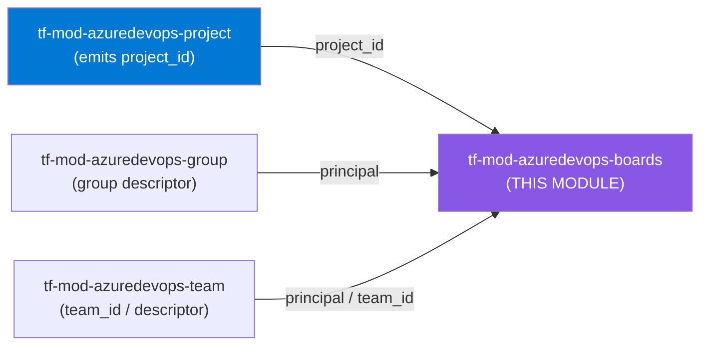
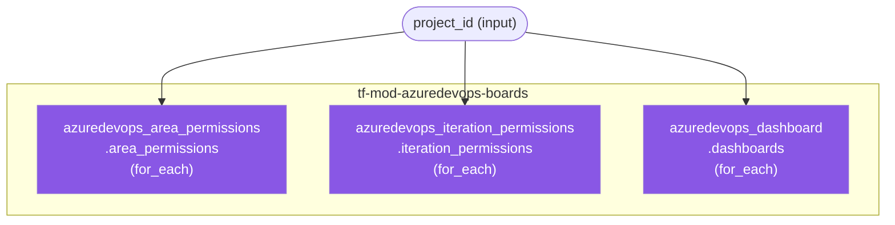

# 🔷 Azure DevOps **Boards** Terraform Module

> **Aggregates Azure Boards configuration — area-path & iteration-path permissions and project/team dashboards — behind one project-scoped, fully optional module boundary.** Built for azuredevops **v1.x**.


---

## 🧩 Overview

This module manages the **work-tracking governance surface** of an Azure DevOps project:

- 🔐 **Area-path permissions** — grant/deny group principals on existing Area (Component) classification nodes.
- 🗓️ **Iteration-path permissions** — grant/deny group principals on existing Iteration (Sprint) classification nodes.
- 📊 **Dashboards** — create project-scoped or team-scoped Boards dashboards with a configurable refresh interval.

It is an **aggregation module**: there is **no primary `this` resource**. Each resource type is an independently-optional `for_each` collection. Callers use **any, all, or none** of the three collections — an unused collection is simply an empty map.

> 💡 **Why it matters:** Area/iteration ACEs and dashboards are the controls that decide *who can see and edit which work items* and *how teams visualize delivery*. Codifying them removes click-ops drift and makes every Boards permission auditable in version control.

---

## ❤️ Support this project

If these Terraform modules have been helpful to you or your organization, I'd appreciate your support in any of the following ways:

- ⭐ **Star this repository** to help others discover this Terraform module.
- 🤝 **Connect with me on LinkedIn:** [linkedin.com/in/microsoftexpert](https://www.linkedin.com/in/microsoftexpert)
- ☕ **Buy me a coffee:** [buymeacoffee.com/microsoftexpert](https://buymeacoffee.com/microsoftexpert)

Whether it's a star, a professional connection, or a coffee, every gesture helps keep these modules actively maintained and continually improving. Thank you for being part of the community!

---

## 🗺️ Where this fits in the family



Most resources in the suite flow from `tf-mod-azuredevops-project` via `project_id`; this module additionally consumes **group/team subject descriptors** for its permission collections.

---

## 🧬 What this module builds

This is an **aggregation** module — there is **no parent `this` node**. The three peer collections are wholly independent:



**Resource inventory:**

- `azuredevops_area_permissions.area_permissions` — `for_each` over `var.area_permissions`
- `azuredevops_iteration_permissions.iteration_permissions` — `for_each` over `var.iteration_permissions`
- `azuredevops_dashboard.dashboards` — `for_each` over `var.dashboards`

---

## ✅ Provider / Versions

| Requirement | Version |
|---|---|
| Terraform | `>= 1.12.0` |
| `microsoft/azuredevops` | `>= 1.0, < 2.0` (authored & validated against **v1.15.1**) |

The module declares the provider **requirement** only — it configures **no** `provider "azuredevops" {}` block. The root module supplies the org URL + PAT or Azure AD service principal.

---

## 🔑 Required Azure DevOps Scopes / Auth

| Scope / Role | PAT scope | Service-principal role | Required for |
|---|---|---|---|
| Work-tracking node security | Work Items (Read, Write & Manage) + Project and Team (Read, Write & Manage) | **Project Administrators** (membership) | `area_permissions`, `iteration_permissions` — editing ACEs on the CSS / Iteration security namespaces |
| Dashboards | Work Items (Read & Write) | **Project Administrators** (project dashboards) · **Team Administrator** + team membership (team dashboards) | `dashboards` — creating/editing a dashboard |

> ⚠️ Editing classification-node ACEs is governed by **group membership, not a PAT scope**. The running identity must belong to **Project Administrators** (or hold node-level *Edit this node* / *Create child nodes*). A correctly-scoped PAT held by a non-administrator identity still returns **403**. Granting a service principal these rights org-wide is a **Project Collection Administrator** action — route that approval through Cloud Platform / Security.

---

## 📁 Module Structure

```
tf-mod-azuredevops-boards/
├── providers.tf # Terraform & provider version pins (no provider block)
├── variables.tf # project_id + three typed collection maps
├── main.tf # three for_each collections — no `this`
├── outputs.tf # map outputs keyed by collection key
├── SCOPE.md # cross-module contract + required scopes/auth
└── README.md # this file
```

---

## ⚙️ Quick Start

```hcl
module "boards" {
  source = "git::https://github.com/microsoftexpert/tf-mod-azuredevops-boards?ref=v1.0.0"

  project_id = module.project.project_id

  dashboards = {
    delivery = {
      name = "Delivery Overview"
    }
  }
}
```

Every collection defaults to `{}`, so the smallest valid call passes only `project_id`.

---

## 🔌 Cross-Module Contract

### Consumes

| Input | Type | Source module |
|---|---|---|
| `project_id` | `string` | `tf-mod-azuredevops-project` (`project_id`) |
| `principal` (per entry) | `string` | `tf-mod-azuredevops-group` / `tf-mod-azuredevops-team` (group **subject descriptor**) |
| `team_id` (per dashboard) | `string` | `tf-mod-azuredevops-team` (`id`) |

### Emits

| Output | Description | Consumed by |
|---|---|---|
| `area_permission_ids` | Map of area-permission key → resource ID | audit / access review |
| `iteration_permission_ids` | Map of iteration-permission key → resource ID | audit / access review |
| `dashboard_ids` | Map of dashboard key → dashboard ID | downstream references / audit |
| `dashboard_owner_ids` | Map of dashboard key → owner ID (project or team) | audit |
| `ids` | Flattened `"<collection>/<key>" → id` map of everything managed | audit / access review |

> ℹ️ Every output is a **map keyed by your collection key** — an unused collection yields `{}`, never an error. No output is `sensitive`; this module manages no secrets.

---

## 📚 Example Library

<details>
<summary><b>1 · Minimal — project-wired, single dashboard</b></summary>

```hcl
module "boards" {
  source     = "git::https://github.com/microsoftexpert/tf-mod-azuredevops-boards?ref=v1.0.0"
  project_id = module.project.project_id

  dashboards = {
    delivery = { name = "Delivery Overview" }
  }
}
```
</details>

<details>
<summary><b>2 · Root-area read access for a group</b></summary>

```hcl
module "boards" {
  source     = "git::https://github.com/microsoftexpert/tf-mod-azuredevops-boards?ref=v1.0.0"
  project_id = module.project.project_id

  area_permissions = {
    readers_root = {
      principal = data.azuredevops_group.readers.id # subject descriptor
      permissions = {
        GENERIC_READ   = "Allow"
        WORK_ITEM_READ = "Allow"
      }
      # path omitted -> root area "/"
    }
  }
}
```
</details>

<details>
<summary><b>3 · Deny a group on a specific area branch</b></summary>

```hcl
area_permissions = {
  contractors_finance = {
    principal = data.azuredevops_group.contractors.id
    path      = "Finance"
    permissions = {
      GENERIC_READ    = "Deny"
      WORK_ITEM_READ  = "Deny"
      WORK_ITEM_WRITE = "Deny"
    }
  }
}
```
</details>

<details>
<summary><b>4 · Delegate area-node management (create/edit children)</b></summary>

```hcl
area_permissions = {
  team_leads = {
    principal = data.azuredevops_group.team_leads.id
    path      = "Platform"
    permissions = {
      GENERIC_READ    = "Allow"
      GENERIC_WRITE   = "Allow"
      CREATE_CHILDREN = "Allow"
      DELETE          = "Deny"
    }
  }
}
```
</details>

<details>
<summary><b>5 · Iteration (sprint) permissions at the root</b></summary>

```hcl
iteration_permissions = {
  readers_root = {
    principal = data.azuredevops_group.readers.id
    permissions = {
      GENERIC_READ    = "NotSet"
      CREATE_CHILDREN = "Deny"
      DELETE          = "Deny"
    }
  }
}
```
</details>

<details>
<summary><b>6 · Iteration permissions on a named sprint path</b></summary>

```hcl
iteration_permissions = {
  release_train = {
    principal = data.azuredevops_group.release_managers.id
    path      = "Release 2026"
    permissions = {
      CREATE_CHILDREN = "Allow"
      GENERIC_READ    = "Allow"
      DELETE          = "Allow"
    }
  }
}
```
</details>

<details>
<summary><b>7 · Merge instead of replace existing ACEs</b></summary>

```hcl
area_permissions = {
  audit_overlay = {
    principal = data.azuredevops_group.auditors.id
    path      = "Compliance"
    replace   = false # merge into ACEs managed outside Terraform
    permissions = {
      GENERIC_READ   = "Allow"
      WORK_ITEM_READ = "Allow"
    }
  }
}
```

> `replace` defaults to `true` — the ACE set is replaced wholesale. Use `false` only when intentionally coexisting with externally-managed ACEs.
</details>

<details>
<summary><b>8 · Project-scoped dashboard with description + refresh</b></summary>

```hcl
dashboards = {
  exec = {
    name             = "Executive Rollup"
    description      = "Portfolio burn-up and risk register"
    refresh_interval = 5 # minutes; only 0 or 5 are valid
  }
}
```
</details>

<details>
<summary><b>9 · Team-scoped dashboard</b></summary>

```hcl
dashboards = {
  platform_team = {
    name    = "Platform Team Board"
    team_id = module.team_platform.id
  }
}
```

> Team dashboards must have **unique names**; project dashboards may share a name.
</details>

<details>
<summary><b>10 · Multiple dashboards in one call</b></summary>

```hcl
dashboards = {
  delivery = { name = "Delivery Overview" }
  quality  = { name = "Quality & Test", refresh_interval = 5 }
  exec     = { name = "Executive Rollup", description = "Portfolio view" }
}
```
</details>

<details>
<summary><b>11 · Per-dashboard timeouts</b></summary>

```hcl
dashboards = {
  heavy = {
    name = "Analytics Heavy"
    timeouts = {
      create = "10m"
      delete = "10m"
    }
  }
}
```

> Only `azuredevops_dashboard` supports `timeouts`; the permission collections do not.
</details>

<details>
<summary><b>12 · Cross-module wiring — group descriptors → permissions</b></summary>

```hcl
module "group_readers" {
  source     = "git::https://github.com/microsoftexpert/tf-mod-azuredevops-group?ref=v1.0.0"
  project_id = module.project.project_id
  name       = "Boards Readers"
}

module "boards" {
  source     = "git::https://github.com/microsoftexpert/tf-mod-azuredevops-boards?ref=v1.0.0"
  project_id = module.project.project_id

  area_permissions = {
    readers = {
      principal   = module.group_readers.descriptor # subject descriptor output
      permissions = { GENERIC_READ = "Allow", WORK_ITEM_READ = "Allow" }
    }
  }
}
```
</details>

<details>
<summary><b>13 · Reference emitted IDs from another module</b></summary>

```hcl
output "boards_dashboard_ids" {
  value = module.boards.dashboard_ids
}

output "all_boards_resource_ids" {
  value = module.boards.ids # "<collection>/<key>" => id
}
```
</details>

<details>
<summary><b>14 · End-to-end composition (mandatory finale)</b></summary>

```hcl
module "project" {
  source     = "git::https://github.com/microsoftexpert/tf-mod-azuredevops-project?ref=v1.0.0"
  name       = "Lending Platform"
  visibility = "private"
}

module "team_platform" {
  source     = "git::https://github.com/microsoftexpert/tf-mod-azuredevops-team?ref=v1.0.0"
  project_id = module.project.project_id
  name       = "Platform"
}

module "group_readers" {
  source     = "git::https://github.com/microsoftexpert/tf-mod-azuredevops-group?ref=v1.0.0"
  project_id = module.project.project_id
  name       = "Boards Readers"
}

module "boards" {
  source     = "git::https://github.com/microsoftexpert/tf-mod-azuredevops-boards?ref=v1.0.0"
  project_id = module.project.project_id

  area_permissions = {
    readers_root = {
      principal   = module.group_readers.descriptor
      permissions = { GENERIC_READ = "Allow", WORK_ITEM_READ = "Allow" }
    }
    contractors_finance = {
      principal   = module.group_readers.descriptor
      path        = "Finance"
      permissions = { WORK_ITEM_READ = "Deny" }
    }
  }

  iteration_permissions = {
    readers_root = {
      principal   = module.group_readers.descriptor
      permissions = { GENERIC_READ = "Allow", CREATE_CHILDREN = "Deny" }
    }
  }

  dashboards = {
    delivery      = { name = "Delivery Overview", refresh_interval = 5 }
    platform_team = { name = "Platform Team Board", team_id = module.team_platform.id }
  }
}
```
</details>

---

## 📥 Inputs

<details>
<summary><b>Full input schemas</b></summary>

```hcl
variable "project_id" {
  type = string # IMMUTABLE — wire from tf-mod-azuredevops-project (project_id)
}

variable "area_permissions" {
  type = map(object({
    principal   = string           # group subject descriptor
    permissions = map(string)      # action => "Allow" | "Deny" | "NotSet"
    path        = optional(string) # area path; omit/"/" for root
    replace     = optional(bool, true)
  }))
  default = {}
  # actions: GENERIC_READ, GENERIC_WRITE, CREATE_CHILDREN, DELETE,
  # WORK_ITEM_READ, WORK_ITEM_WRITE, MANAGE_TEST_PLANS,
  # MANAGE_TEST_SUITES, WORK_ITEM_SAVE_COMMENT
}

variable "iteration_permissions" {
  type = map(object({
    principal   = string           # group subject descriptor
    permissions = map(string)      # action => "Allow" | "Deny" | "NotSet"
    path        = optional(string) # iteration path; omit/"/" for root
    replace     = optional(bool, true)
  }))
  default = {}
  # actions: GENERIC_READ, GENERIC_WRITE, CREATE_CHILDREN, DELETE
}

variable "dashboards" {
  type = map(object({
    name             = string
    description      = optional(string)
    team_id          = optional(string)    # omit for project-scoped
    refresh_interval = optional(number, 0) # 0 or 5
    timeouts = optional(object({
      create = optional(string)
      read   = optional(string)
      update = optional(string)
      delete = optional(string)
    }), {})
  }))
  default = {}
}
```

**Validations:** permission states constrained to `Allow`/`Deny`/`NotSet`; `refresh_interval` constrained to `0` or `5`; `project_id` must be non-empty.
</details>

---

## 🧾 Outputs

| Output | Type | Sensitive | Description |
|---|---|---|---|
| `area_permission_ids` | `map(string)` | no | area-permission key → resource ID |
| `iteration_permission_ids` | `map(string)` | no | iteration-permission key → resource ID |
| `dashboard_ids` | `map(string)` | no | dashboard key → dashboard ID |
| `dashboard_owner_ids` | `map(string)` | no | dashboard key → owner ID (project or team) |
| `ids` | `map(string)` | no | flattened `"<collection>/<key>" → id` for every managed resource |

> No output is `sensitive` — area/iteration permissions and dashboards carry no secret material.

---

## 🧠 Architecture Notes

- **Project-scoped, organization-aware.** Every collection hangs off a single `project_id`. Dashboards may further narrow to a **team** via `team_id`; permissions apply to project-level classification nodes.
- **Permissions target existing nodes only.** Provider **v1.15.1** exposes `azuredevops_area` / `azuredevops_iteration` only as **data sources** — there is no resource to *create* a classification node. This module manages **ACEs on existing area/iteration paths** and **dashboards**, not the node hierarchy. Create the node hierarchy through the portal/REST/process first.
- **`principal` is a subject descriptor.** The provider expects a **group subject descriptor**, not a display name. Source it from `tf-mod-azuredevops-group` / `tf-mod-azuredevops-team` outputs (or a `data.azuredevops_group`).
- **`replace` semantics.** Both permission collections default `replace = true` → the ACE set is **replaced** on each apply. Use `replace = false` to merge with ACEs maintained outside Terraform; expect the two to fight if both manage the same action.
- **Immutable fields.** `project_id` is ForceNew on dashboards (and effectively fixed for the permission ACEs). Changing it destroys/recreates.
- **Eventual consistency.** Newly-created groups/teams and freshly-created classification nodes can take a few seconds to propagate; an apply that races node creation may need a re-run.
- **No write-only secrets.** Unlike service-connection or variable-group modules, nothing here is write-only — all outputs are safely readable.
- **Dashboard inheritance is not managed here.** Per Microsoft Learn, dashboard *permissions* (edit/delete/manage) are set at the team/project level and the provider has no resource for them; this module only creates the dashboard itself.

---

## 🧱 Design Principles

- **Aggregation, not composite** — no dominant resource, so no `this`; every resource is a peer `for_each` collection named by role.
- **Type is the contract** — deeply-typed `object` maps, `optional` defaults, and `validation {}` blocks reject malformed input at plan time.
- **Independently optional** — each collection defaults to `{}`; callers compose any subset.
- **Secure, low-surprise defaults** — `replace = true` keeps Terraform authoritative; `refresh_interval = 0` (no auto-refresh) is the calm default.
- **Total renderer** — `main.tf` is a pure projection with `try(x, null)` on optional fields and a guarded `dynamic "timeouts"` block.
- **Map outputs** — everything keyed by the caller's collection key for clean composition and audit.

---

## 🚀 Runbook

```powershell
cd C:\GitHubCode\newazuredevopsmodules\tf-mod-azuredevops-boards
terraform init -backend=false
terraform validate
terraform fmt -check
```

> `terraform plan` / `apply` require live organization credentials (org URL + PAT, or an Azure AD service principal). Use a **non-production** organization with a dedicated identity holding the scopes above. **Never test against the production org.** Clean up `.terraform/` and `.terraform.lock.hcl` before committing.

---

## 🧪 Testing

- ✅ `terraform init -backend=false` — passes.
- ✅ `terraform validate` — *"The configuration is valid."*
- ✅ `terraform fmt -check` — clean.
- Negative checks: a permission state outside `Allow`/`Deny`/`NotSet` and a `refresh_interval` other than `0`/`5` both fail validation at plan time.
- Live: apply against a non-production org, then confirm via the portal (Project Settings → Boards → Areas/Iterations → Security, and the Dashboards directory).

---

## 💬 Example Output

```text
Apply complete! Resources: 4 added, 0 changed, 0 destroyed.

Outputs:

area_permission_ids = {
 "readers_root" = "vstfs:///Classification/Node/..."
 "contractors_finance" = "vstfs:///Classification/Node/..."
}
dashboard_ids = {
 "delivery" = "00000000-0000-0000-0000-000000000000"
 "platform_team" = "11111111-1111-1111-1111-111111111111"
}
ids = {
 "area_permissions/readers_root" = "..."
 "dashboards/delivery" = "..."
 "iteration_permissions/readers_root" = "..."
}
```

---

## 🔍 Troubleshooting

| Symptom | Likely cause | Fix |
|---|---|---|
| `403 Forbidden` / `TF401027` on apply | Identity scoped via PAT but **not** a member of **Project Administrators** | ACE edits are governed by group membership, not PAT scope — add the identity to Project Administrators (PCA action). |
| `The classification node... does not exist` | `path` points at a node that was never created | Create the area/iteration node first (portal/REST/process); this module does not create nodes. |
| Permission applies but doesn't take effect | Wrong `principal` — display name passed instead of a subject descriptor | Wire `principal` from `tf-mod-azuredevops-group`/`_team` descriptor outputs. |
| Permissions you set manually keep disappearing | `replace = true` (default) makes Terraform authoritative | Set `replace = false` to merge, or move all ACEs for the node into Terraform. |
| `refresh_interval must be either 0 or 5` | Unsupported refresh value | Use `0` (off) or `5` (minutes) only. |
| Dashboard `name` conflict on a team | Team dashboards require unique names | Rename; only project-level dashboards may share a name. |
| Resource targets the wrong project after a change | `project_id` is immutable (ForceNew) | Expect destroy/recreate; confirm `project_id` is wired from the intended project. |
| Transient "not found" right after creating a group/node | Eventual consistency | Re-run `apply`. |

---

## 🔗 Related Docs

- [Azure Boards — secure your Azure Boards](https://learn.microsoft.com/azure/devops/boards/secure-your-azure-boards?view=azure-devops)
- [Set work tracking permissions (area/iteration paths)](https://learn.microsoft.com/azure/devops/organizations/security/set-permissions-access-work-tracking?view=azure-devops)
- [Security namespace & permission reference — Area/Iteration & Dashboards](https://learn.microsoft.com/azure/devops/organizations/security/permissions?view=azure-devops)
- [Set dashboard permissions](https://learn.microsoft.com/azure/devops/report/dashboards/dashboard-permissions?view=azure-devops)
- Provider: [`azuredevops_area_permissions`](https://registry.terraform.io/providers/microsoft/azuredevops/latest/docs/resources/area_permissions) · [`azuredevops_iteration_permissions`](https://registry.terraform.io/providers/microsoft/azuredevops/latest/docs/resources/iteration_permissions) · [`azuredevops_dashboard`](https://registry.terraform.io/providers/microsoft/azuredevops/latest/docs/resources/dashboard)
- `SCOPE.md` — cross-module contract and required scopes/auth

---

> 💙 *"Infrastructure as Code should be standardized, consistent, and secure."*
